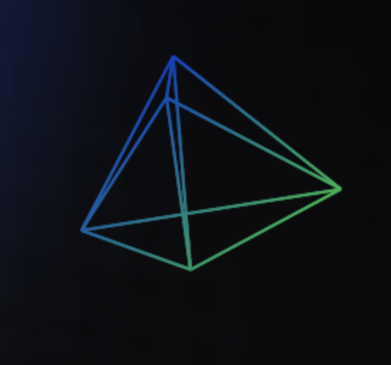

# Jonathan's User Page



Hi! I'm [Jonathan Cui](https://jonathancui.com/) 👋, a third-year transfer student at UCSD. I've conducted [research](https://scholar.google.com/citations?user=oRtbHw4AAAAJ&hl=en) in machine learning previously at Microsoft Research Asia and at Penn State University. See my [publications](#publications) below.

As a programmer, I am interested in programming language and low-level stuff. I've developed my own app [TasteMate](https://tastemate.pro) and my own [programming language](https://math.joncui.sh) for formal proof verification. Here're what I've done and what I want to do:
- [x] My first programming language
- [x] My first app
- [x] My first kernel
- [ ] My parser combinator library
- [ ] My own package manager

Try out my language! For example,

```
type true;
axiom truth: true;

type false;
axiom ex_falso<T>: false -> T;

type or[2];
axiom creation1<T, U>: T -> or[T, U];
axiom creation2<T, U>: U -> or[T, U];
axiom reduction<P, Q, R>: or[P, Q] -> (P -> R) -> (Q -> R) -> R;
axiom case<T>: or[T, T -> false];

let imply<P, Q>: or[P, Q] -> (P -> false) -> Q = |or: or[P, Q], neg: P -> false| -> Q {
    let case1: P -> Q = |p: P| {
        let absurdity: false = neg(p);
        ex_falso::<Q>(absurdity)
    };
    let case2: Q -> Q = |x: Q| -> Q { x };
    reduction::<P, Q, Q>(or, case1, case2)
};

let contrapositive<P, Q>: (P -> Q) -> (Q -> false) -> (P -> false) = |pf: P -> Q, second: Q -> false, p: P| -> false { second(pf(p)) };
```

I love:
1. Arch
2. Rust
3. Hyprland
(in that order.)

## Publications

- Zhao, S., **Cui, J.**, Sheng, Y., Dong, Y., Liang, X., Chang, E. I., & Xu, Y. (2021). Large scale image completion via co-modulated generative adversarial networks. *International Conference on Learning Representations.* https://openreview.net/forum?id=sSjqmfsk95O.
- Li, Y., **Cui, J.**, Sheng, Y., Liang, X., Wang, J., Eric, I., ... & Xu, Y. (2021). Whole brain segmentation with full volume neural network. *Computerized Medical Imaging and Graphics*, 93, 101991.
- **Cui, J.**, Araujo, D. A., Saha, S., & Kabir, M. F. (2024). CS-Mixer: A Cross-Scale Vision Multi-Layer Perceptron with Spatial–Channel Mixing. *IEEE Transactions on Artificial Intelligence, 1*(01), 1-13.
- **Cui, J**. & Araujo, D. A. (2024). Rethinking use-restricted open-source licenses for regulating abuse of generative models. *Big Data & Society 11*(1). https://doi.org/10.1177/20539517241229699

> Entities must not be multiplied beyond necessity.
> — William of Ockham

